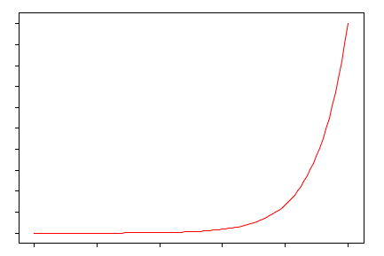
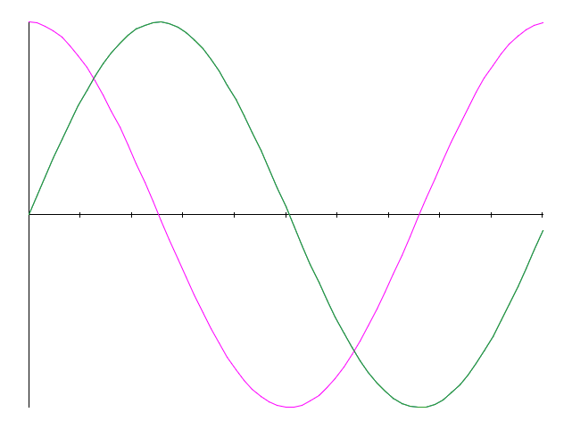
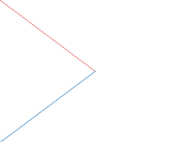

Graph
=====

This is a toy plotting library, written in [nim](http://nim-lang.org) and based on nimage.  
The end goal is to have a tiny plotting lib to include in [inim](https://github.com/stisa/INim)  
Outputs a `.png` file.

A copy of [nimage](https://github.com/haldean/nimage) is required for this to work.
Just clone it inside `graph` folder.  
Some examples:

### Example 1

### Example 2

### Example 3
