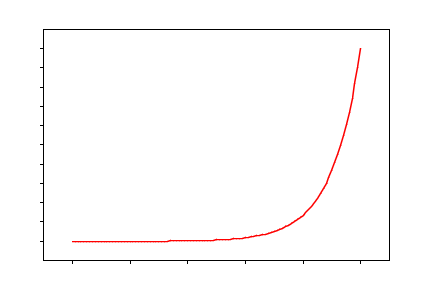

Graph
=====

This is a basic plotting library, written in [nim](http://nim-lang.org) and based on nimPNG.  
The end goal is to have a tiny plotting lib to use with [jupyternim](https://github.com/stisa/jupyternim)  
Outputs a `.png` file or a string that contains the `png` as binary data.

For what I want to achieve and where I'm at, see [target](notes/target.md)

Some examples are in [examples](examples):

### Example 1

```nim
import graph
from graph/funcs import exp

let xx = linspace(0.0,10,0.1)
var srf = plotXY(xx,exp(xx),Red,White)
srf.saveTo("example1.png")
```

### Example 2


```nim
import graph,
       graph/draw,
       graph/funcs # has the sin(openarray):openarray def
import math

let xx = linspace(0.0, 2*Pi, 0.1) 

# Create the surface with a plot in purple
var srf = plotXY(xx,cos(xx),Purple)

# Pass the proc (eg ``sin``) to be mapped to xx so that yy=sin(xx)
srf.plotProc(xx, sin, Green)

# Save to file
srf.saveTo("example.png")
```

### Mapping procs
If you need operations not in [/funcs](), map them:
```nim
import math,sequtils
# Map ln to a seq:
proc ln(x:seq[float]):seq[float] =
  x.mapit(ln(it))
```
Alternatively, if you have a map `proc(T)->T`, you can just use
`plotProc`, see [example2](examples/example2.nim)

## Current structure
- **graph**: exposes linspace, plotXY and saveSurfaceTo ( basic functionality )

Inside `graph` there are specific apis:
- color: exposes various colours and the proc `color(r,g,b,a)`
- draw: drawing, so `line(x,y,x1,y1,color)`, functions to draw Axis, procs, etc
- plot: the implementation of `Surface` and `Axis`
- funcs: misc functions and linspace

## TODO:

* matplotlib defaults
  - figure size is 6.4x4.8"
  - dpi is 100  
* restrocture the code into something cleaner, with clear module names and separtion
* [target style](notes/target.md)
* plotProc should lazily evaluate the proc
* have a single `plot(x,y)`  proc