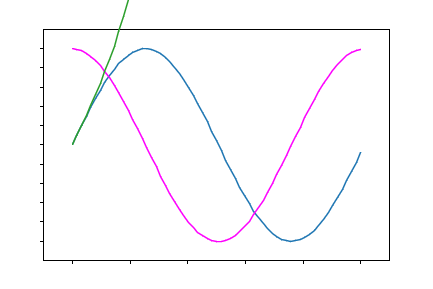

Graph
=====

This is a toy plotting library, written in [nim](http://nim-lang.org) and based on nimage.  
The end goal is to have a tiny plotting lib to include in [inim](https://github.com/stisa/INim)  
Outputs a `.png` file.
  
Some examples are inside [examples](examples):

### Example 1

```nim
import grapher
from graph/funcs import exp

let xx = linspace(0.0,10,0.1)
var srf = plotXY(xx,exp(xx),Red,White)
srf.saveTo("example1.png")
```

### Example 2


```nim
import grapher, 
       graph/draw, # Exposes drawFunc
       graph/funcs # Exposes sin, cos, linspace
import math,sequtils

let xx = linspace(0.0, 2*Pi, 0.1) 

# Create the surface with a plot in blue
var srf = plotXY(xx,sin(xx),Blue)

# Draw a cos over the surface
srf.drawFunc(xx,cos(xx), Purple)

# Save to file
srf.saveTo("example2.png")
```

### Mapping procs
If you need operations not in [/funcs](), map them:
```nim
import math,sequtils
# Map ln to a seq:
proc ln(x:seq[float]):seq[float] =
  x.mapit(ln(it))
```

## Current structure
- **grapher**: exposes linspace, plotXY and saveSurfaceTo ( basic functionality )

Inside `graph` there are specific apis:
- color: exposes various colours and the proc `color(r,g,b,a)`
- draw: drawing, so `line(x,y,x1,y1,color)`, functions to draw Axis, procs, etc
- plot: the implementation of `Surface` and `Axis`
- funcs: misc functions and linspace
