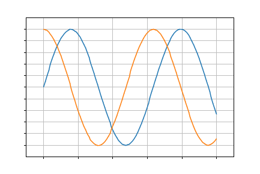

Graph
=====

This is a basic plotting library, written in [nim](http://nim-lang.org) and based on nimPNG.  
The end goal is to have a tiny plotting lib to use with [jupyternim](https://github.com/stisa/jupyternim)  
Outputs a `.png` file or a string that contains the `png` as binary data.

For what I want to achieve and where I'm at, see [target](notes/target.md)

Some examples are in [examples](examples):

### Example 

```nim
import graph, math, arraymancer
let 
  x  = arange(0.0'f64, 10,0.1)
let 
  y  = sin(x)
  y2 = cos(x)
var srf = plot(x.data,y.data, Viridis.blue, grid=true)
srf.plot(x.data, y2.data, Viridis.orange)
# Save to file
srf.saveTo("currentpng.png")

```

## Current structure
- **graph**: exposes everything ( basic functionality )

Inside `graph` there are specific apis:
- color: exposes various colours and the proc `color(r,g,b,a)`
- draw: drawing, so `line(x,y,x1,y1,color)`, functions to draw Axis, procs, etc
- surface: the implementation of `Surface` and `Axis`

## TODO:

* matplotlib defaults
  - figure size is 6.4x4.8"
  - dpi is 100  
* restrocture the code into something cleaner, with clear module names and separtion
* [target style](notes/target.md)
* plotProc should lazily evaluate the proc
* have a single `plot(x,y)`  proc
* better integration with Arraymancer (a Concept that matches if .data and [] ?)
* integrate chroma? (need to contribute blend?)
* separate drawing layers for the plot and the background/names/etc so that lines aren't overwritten
* can I use Arraymancer's tensor without blas? Would they work in js?
* documentation