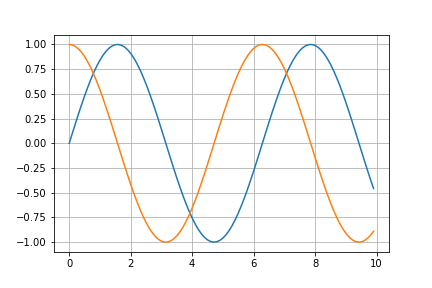
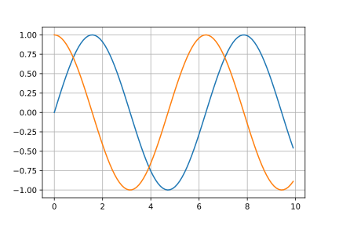

Goals
------
The goal is to have a very simple plotting library for 2d line plots, with an api modeled
after matlab and matplotlib.


## Target  

The reference style will be matplotlib-like, a goal is to be able to produce something matching:  

PNG:  



SVG:  



Those are produced by
```python
import matplotlib.pyplot as pp
import numpy as np
x = np.arange(0.0,10,0.1)
y1 = np.sin(x)
y2 = np.cos(x)
fig, ax = pp.subplots()
ax.plot(x,y1,x,y2)
ax.grid()
fig.savefig("targetpng.png")
fig.savefig("targetsvg.svg")
```

## Current
Currently we have:  

PNG:  


with:

```nim
import ../src/graph
import ../src/graph/draw,../src/graph/funcs
import math

let x = linspace(0.0, 10, 0.1) 

var srf = plotXY(x,sin(x),Blue)
srf.plotProc(x, cos, Red)

# Save to file
srf.saveTo("currentpng.png")
```